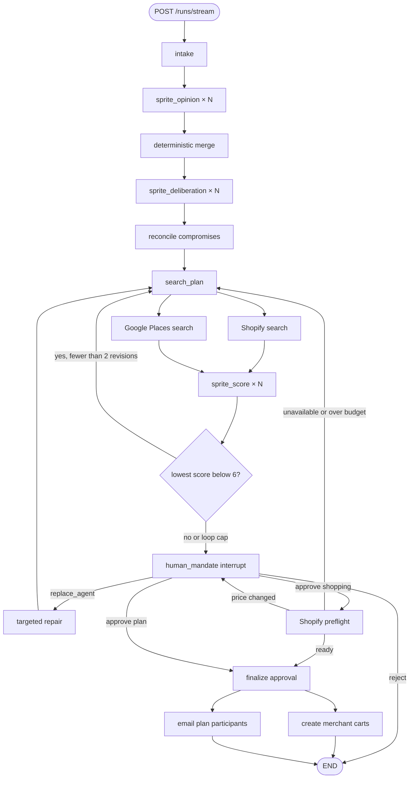

# Affinity backend agent integration

This document is the frontend and deployment contract for Affinity's Python
LangGraph backend. The backend owns agent reasoning, provider search, proposal
repair, approval checkpoints, cart creation, and plan notifications. The
frontend owns mission entry, visualization, Leap Motion input, and checkout-link
presentation.

## Backend lifecycle



The opinion, deliberation, and scoring stages dynamically fan out once per
invited profile. There is no fixed family size.

## Run the service

From the repository root:

```bash
source .venv/bin/activate
pip install -r backend/requirements.txt
uvicorn backend.api:app --reload --port 8000 --env-file .env
```

Local base URL:

```text
http://localhost:8000
```

Health check:

```http
GET /health
```

```json
{"status":"ok"}
```

## Recommended frontend flow

1. Generate a stable `threadId` for the mission.
2. Call `POST /runs/stream` and consume Server-Sent Events.
3. Render opinions, deliberations, constraints, searches, and scores as they
   arrive.
4. When `awaiting_mandate` arrives, show the complete proposal.
5. Let the user approve, permanently reject, or request an agent replacement.
6. Send that action to `POST /runs/resume/stream` using the same `threadId`.
7. Continue consuming events. A replacement or preflight change can produce
   another `awaiting_mandate` event.
8. Treat `run_state.status === "complete"` as terminal. For shopping, show
   `state.carts[].checkoutUrl`. For plans, show notification results.

The frontend must not assume one resume call always completes a run. Shopify
preflight can repair an unavailable item or request fresh consent after a price
change.

## Start a shopping mission

```http
POST /runs/stream
Content-Type: application/json
Accept: text/event-stream
```

```json
{
  "threadId": "family-basketball-001",
  "mission": {
    "kind": "shopping",
    "occasion": "Pickup basketball",
    "budget": 20,
    "freeText": "Choose one full-size basketball for the group",
    "type": "shared",
    "invitedSpriteIds": ["player", "coach", "parent"],
    "shoppingSlots": [
      {
        "id": "ball",
        "query": "full-size indoor outdoor basketball under 20 dollars",
        "quantity": 1
      }
    ]
  },
  "profiles": [
    {
      "id": "player",
      "name": "Player",
      "relationship": "family member",
      "look": "Blue hoodie",
      "colors": ["blue"],
      "personality": ["energetic"],
      "loves": ["durable basketball", "good grip"],
      "avoids": ["mini novelty balls"],
      "houseRules": []
    },
    {
      "id": "coach",
      "name": "Coach",
      "relationship": "family member",
      "look": "Green jacket",
      "colors": ["green"],
      "personality": ["practical"],
      "loves": ["official size 7", "indoor outdoor use"],
      "avoids": [],
      "houseRules": []
    },
    {
      "id": "parent",
      "name": "Parent",
      "relationship": "family member",
      "look": "Gold sweater",
      "colors": ["gold"],
      "personality": ["value conscious"],
      "loves": ["good value"],
      "avoids": ["overpriced products"],
      "houseRules": []
    }
  ]
}
```

`profiles` may contain any number of runtime profiles. Every ID in
`mission.invitedSpriteIds` must exist in either the supplied profiles or the
bundled demo fixtures.

## Start a plan mission

```json
{
  "threadId": "family-night-001",
  "mission": {
    "kind": "plan",
    "occasion": "Family night",
    "budget": 160,
    "freeText": "Dinner followed by an interactive activity",
    "type": "shared",
    "invitedSpriteIds": ["wife", "daughter", "son"],
    "location": {
      "label": "Georgia Tech, Atlanta, GA",
      "latitude": 33.7756,
      "longitude": -84.3963,
      "radiusMeters": 8000
    },
    "when": "Saturday evening",
    "planSlots": [
      {
        "id": "dinner",
        "query": "casual vegetarian-friendly dinner",
        "includedType": "restaurant",
        "minRating": 4,
        "priceLevels": ["$", "$$"],
        "durationMinutes": 90
      },
      {
        "id": "activity",
        "query": "interactive group activity",
        "minRating": 4,
        "priceLevels": ["$", "$$"],
        "durationMinutes": 120
      }
    ]
  }
}
```

Google Places discovers options and returns venue and Maps links. It does not
confirm a table, hold inventory, or create a reservation.

## Mission fields

| Field | Required | Meaning |
| --- | --- | --- |
| `occasion` | yes | Human-readable mission name. |
| `budget` | yes | Positive numeric mission budget. |
| `freeText` | yes | Additional intent and context. |
| `type` | yes | `shared` or `gift`. |
| `invitedSpriteIds` | yes | IDs that dynamically fan out through the graph. |
| `recipientId` | for gifts | Must be an invited sprite. Its wishes receive weight 2. |
| `kind` | no | `shopping` by default, or `plan`. |
| `shoppingSlots` | recommended for shopping | Explicit categories to fill. |
| `location` | for plans | Label and optional coordinate/radius bias. |
| `when` | optional | Human-readable plan time. |
| `planSlots` | for plans | Required itinerary stops. |

## Profile fields

| Field | Required | Meaning |
| --- | --- | --- |
| `id` | yes | Stable unique sprite identifier. |
| `name` | yes | Display name. |
| `relationship` | yes | Relationship or role. |
| `look` | yes | Frontend sprite description. |
| `colors` | yes | Display preferences. |
| `personality` | yes | Reasoning/personality hints. |
| `loves` | yes | Positive preferences. |
| `avoids` | yes | Vetoes and dislikes. |
| `houseRules` | yes | Machine-enforceable hard rules. |
| `email` | optional | Recipient address for approved plans. |
| `emailNotifications` | optional | Defaults to true when an email exists. |

Supported hard rules:

```json
{"type":"maxHeight","inches":48,"why":"The ceiling is low"}
```

```json
{"type":"excludedTag","tag":"glass","why":"Avoid breakable decorations"}
```

## SSE format

Every event is a standard SSE frame:

```text
event: opinion
data: {"spriteId":"player","say":"...","hardRules":[],"wishes":[],"vetoes":[]}

```

The final event for each HTTP execution segment is `run_state`.

### Event order and payloads

| Event | Important payload |
| --- | --- |
| `mission` | Normalized mission. |
| `opinion` | `spriteId`, `say`, `hardRules`, `wishes`, `vetoes`. |
| `constraints` | Merged `hardRules`, weighted `wishes`, and `conflicts`. |
| `deliberation` | Public response, replies, agreements, concerns, compromises. |
| `consensus` | Constraint board after compromise wishes. |
| `search_plan` | Provider-independent query variants per slot. |
| `bundle` | Selected products, total, explanations, alternatives. |
| `plan` | Selected places, links, explanations, alternatives. |
| `score` | One sprite's 0–10 score and spoken reaction. |
| `revision` | Lowest-scoring sprite and its new search complaint. |
| `scores_complete` | Final score collection. |
| `awaiting_mandate` | Proposal and required handshake metadata. |
| `repair_requested` | Raw replacement action received from the UI. |
| `repair` | Normalized targeted repair instruction. |
| `preflight` | Shopify refresh status, changes, and current total. |
| `receipt` | Final approval or rejection receipt. |
| `carts` | Merchant checkout handoff objects. |
| `notifications` | Per-recipient plan-email outcomes. |
| `run_state` | Public checkpointed state and interrupt status. |
| `error` | Safe error detail and HTTP-style status. |

Parallel sprite events can arrive in any order. Key rendering by `spriteId`
instead of array position prevents UI ordering assumptions.

## The mandate interrupt

An interrupted response ends with:

```json
{
  "threadId": "family-basketball-001",
  "status": "interrupted",
  "interrupts": [
    {
      "id": "...",
      "value": {
        "type": "cart_mandate",
        "bundle": {},
        "requiredGesture": "handshake",
        "holdSeconds": 1.5
      }
    }
  ],
  "state": {}
}
```

Plan mandates use `type: "plan_mandate"`, include `plan`, and can include a
`notificationPreview`.

## Resume actions

Use the exact same `threadId` that started the run.

### Approve

The frontend should send approval only after validating the Leap Motion gesture
and producing a non-empty signature.

```http
POST /runs/resume/stream
Content-Type: application/json
Accept: text/event-stream
```

```json
{
  "threadId": "family-basketball-001",
  "action": "approve",
  "signature": "gesture-signature-or-hash"
}
```

Shopping approval runs Shopify preflight. If the price changed, the backend
interrupts again with the refreshed bundle. If an item is unavailable or the
new total exceeds budget, the graph autonomously repairs the affected slot,
rescoring before another mandate.

### Agent replacement with a human prompt

```json
{
  "threadId": "family-basketball-001",
  "action": "replace_agent",
  "itemId": "shopify:gid://shopify/ProductVariant/123",
  "prompt": "Find a quieter outdoor ball under 18 dollars"
}
```

### Autonomous agent replacement

Omit `prompt` and the backend will derive replacement guidance from the item's
slot, name, council constraints, and prior search state.

```json
{
  "threadId": "family-basketball-001",
  "action": "replace_agent",
  "itemId": "shopify:gid://shopify/ProductVariant/123"
}
```

The rejected ID remains excluded for the rest of the run.

### Permanently reject the proposal

```json
{
  "threadId": "family-basketball-001",
  "action": "reject",
  "itemId": "shopify:gid://shopify/ProductVariant/123"
}
```

This ends the run without creating carts, sending notifications, making a
reservation, or submitting payment.

For backward compatibility, the API also accepts `approve: true` or
`approve: false`, but new integrations should use `action`.

## Product bundle contract

Important fields:

```json
{
  "items": [
    {
      "id": "shopify:...",
      "slot": "ball",
      "name": "Official Basketball",
      "price": 18.99,
      "currency": "USD",
      "quantity": 1,
      "merchantName": "Sports Shop",
      "merchantDomain": "sports.example",
      "productUrl": "https://...",
      "imageUrl": "https://...",
      "has3dModel": true,
      "models3d": [
        {
          "id": "shopify-model-id",
          "alt": "Interactive product model",
          "previewImageUrl": "https://cdn.shopify.com/.../preview.jpg",
          "sources": [
            {
              "url": "https://cdn.shopify.com/.../product.glb",
              "format": "glb",
              "mimeType": "model/gltf-binary",
              "filesize": 456000
            },
            {
              "url": "https://cdn.shopify.com/.../product.usdz",
              "format": "usdz",
              "mimeType": "model/vnd.usdz+zip"
            }
          ]
        }
      ],
      "selectedBecause": [
        "Fills the ball slot at 18.99.",
        "Passed the budget and household-rule filters."
      ]
    }
  ],
  "total": 18.99,
  "serves": {
    "player": ["shopify:..."]
  },
  "source": "shopify_ucp",
  "rejectedAlternatives": [
    {
      "id": "shopify:alternative",
      "slot": "ball",
      "name": "Alternative Basketball",
      "reason": "Another option produced a fairer preference match or better total value."
    }
  ]
}
```

`has3dModel` is always present on normalized Shopify products. When true, the
frontend can select a GLB/glTF source from `models3d[].sources` for web
rendering or a USDZ source for compatible iOS AR. The backend passes through
only merchant-supplied Shopify model assets; it does not synthesize a model
from product images. Products without a model return `has3dModel: false` and
omit `models3d`.

Do not send users to checkout from an item's discovery-time `checkoutUrl`.
After final approval, use only `state.carts[].checkoutUrl`, which comes from the
post-mandate merchant cart operation.

## Plan contract

Important fields:

```json
{
  "stops": [
    {
      "id": "google-place-id",
      "slot": "dinner",
      "name": "Restaurant Name",
      "address": "123 Example St",
      "rating": 4.7,
      "userRatingCount": 850,
      "priceLevel": "PRICE_LEVEL_MODERATE",
      "openNow": true,
      "reservable": true,
      "googleMapsUri": "https://maps.google.com/...",
      "websiteUri": "https://restaurant.example",
      "photoName": "places/google-place-id/photos/photo-resource",
      "photoAttributions": [
        {"displayName": "Contributor", "uri": "https://example.com/profile"}
      ],
      "selectedBecause": ["Rated 4.7 from 850 reviews."]
    }
  ],
  "location": "Atlanta, GA",
  "when": "Saturday evening",
  "source": "google_places",
  "warnings": [
    "Google Places does not confirm reservation availability or final per-person pricing."
  ]
}
```

`reservable: true` is metadata, not confirmation of an available table.

Place photo names are short-lived Google resources and must not be cached.
Render them through the server-side proxy so the Google API key is never sent
to the browser:

```http
GET /places/photo?name=places/google-place-id/photos/photo-resource&max_width=640
```

The Next frontend exposes the same operation at `/api/places/photo`. Display
every returned `photoAttributions` entry beside the image when the list is not
empty.

## Terminal shopping state

After final approval and cart creation:

```json
{
  "status": "complete",
  "state": {
    "receipt": {
      "status": "approved",
      "threadId": "family-basketball-001",
      "signature": "gesture-signature-or-hash",
      "total": 18.99
    },
    "carts": [
      {
        "merchantDomain": "sports.example",
        "cartId": "merchant-cart-id",
        "checkoutUrl": "https://sports.example/cart/...",
        "total": 18.99,
        "currency": "USD"
      }
    ]
  }
}
```

Products from different merchants create separate carts. Affinity never submits
payment.

## Error handling

Non-streaming endpoints return normal FastAPI errors. Streaming endpoints emit:

```text
event: error
data: {"detail":"Council execution failed","status":500}
```

Validation failures may provide a more specific safe message with status 422.
The frontend should preserve the `threadId`, stop its loading animation, and
offer retry or mission editing. It must not automatically interpret provider
failure as approval or completion.

## Interview extraction

The People Maker's spoken interview posts its transcript here to turn it into
profile preferences. Demo mode (`DEMO_MODE=true` or no `OPENAI_API_KEY`) answers
`503 Live extraction is off`; the frontend then uses its own deterministic
extractor, so there is one fallback lexicon, not two.

```http
POST /interview/extract
Content-Type: application/json
```

```json
{
  "name": "Ava",
  "answers": [
    {"questionId": "weekend", "question": "What did you get up to last weekend?", "answer": "Went hiking, then cooked with friends."},
    {"questionId": "never", "question": "What's one thing you'd never spend money on?", "answer": "Designer handbags."}
  ]
}
```

```json
{
  "loves": ["hiking", "cooking"],
  "avoids": ["luxury brands"],
  "personality": ["outdoorsy", "social"],
  "summary": "Ava is into hiking and cooking, and steers clear of luxury brands.",
  "source": "llm"
}
```

Lists are lower-case, deduplicated, emoji-free, and capped at 6 loves, 3 avoids,
3 single-word personality traits. Provider failures return `502 Extraction failed`.

## Privacy boundary

- Opinion workers receive only their own private profile.
- Deliberation workers receive their own profile and other sprites' public
  statements, not other private profiles.
- API responses intentionally exclude the full internal profile map and local
  catalog.
- API keys and SMTP credentials stay on the Python server.
- Selection explanations are summaries, not private chain-of-thought.

## Current limitations

- The checkpointer is currently in memory. A backend restart loses interrupted
  threads.
- CORS currently allows `http://localhost:3000`; deployment must configure the
  deployed frontend origin.
- Manual replacement with a user-supplied product is not implemented.
- Removing one item without replacement is not implemented.
- Google Places does not make reservations.
- SMS notifications are not implemented.
- Ticketmaster is documented as optional but has no provider adapter.
- SMTP does not guarantee exactly-once delivery without a durable outbox.

## Relevant backend files

| File | Purpose |
| --- | --- |
| `agent.py` | LangGraph nodes, edges, and checkpoint compilation. |
| `nodes.py` | Node behavior, routing, provider filtering, repair, and preflight. |
| `models.py` | Shared mission, state, proposal, and API payload contracts. |
| `llm.py` | Live OpenAI and deterministic demo reasoning adapters. |
| `api.py` | FastAPI, SSE streaming, start, and resume endpoints. |
| `commerce/shopify_ucp.py` | Shopify catalog, product refresh, and cart MCP client. |
| `places/google_places.py` | Google Places Text Search client. |
| `notifications/smtp_email.py` | Post-approval plan email sender. |
| `INTEGRATIONS.md` | Provider credentials and integration boundaries. |
