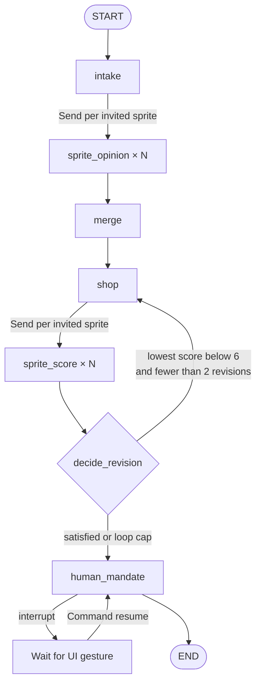

# Affinity agent backend

This directory contains the Python LangGraph pipeline and the HTTP boundary used by the frontend.

## Execution map



The fan-out workers return one-item lists. Reducers on `CouncilState` combine those concurrent writes by `spriteId`, creating the two fan-in barriers before `merge` and `decide_revision`.

## File guide

| File | Responsibility |
| --- | --- |
| `agent.py` | Declares nodes and edges, compiles the graph, and attaches the checkpointer. |
| `nodes.py` | Implements every graph node, fan-out router, and deterministic helper. |
| `models.py` | Defines shared payloads, graph state, and parallel-write reducers. |
| `llm.py` | Produces isolated sprite opinions and scores in live or demo mode. |
| `catalog.py` | Enforces hard rules and budget limits in code. |
| `data.py` | Loads profiles and products from the repository-level `data/` directory. |
| `api.py` | Starts and resumes checkpointed runs over HTTP. |
| `tests/` | Verifies filtering, fan-out/fan-in, revision limits, and the mandate interrupt. |

## State versus memory

`CouncilState` is working memory for one graph thread. `InMemorySaver` preserves that state across the mandate interrupt, but it is cleared when the server process stops. The current backend does not yet implement long-term family memory.

When long-term memory is added, retrieve it inside each sprite branch so a sprite receives only its own relevant history:

```text
intake
  └─ Send(sprite ID)
       └─ retrieve that sprite's relevant memories
            └─ sprite opinion
```

Confirmed outcomes should be written after the mandate, in a separate `write_memory` node between `human_mandate` and `END`. LLM-generated opinions should not automatically become permanent facts.

## Run locally

```bash
source .venv/bin/activate
uvicorn backend.api:app --reload --port 8000
```

Keep `DEMO_MODE=true` for deterministic behavior. To use live structured model calls, set `DEMO_MODE=false`, provide `OPENAI_API_KEY`, and optionally set `OPENAI_SPRITE_MODEL`.

## HTTP lifecycle

Start a mission:

```http
POST /runs
Content-Type: application/json

{
  "threadId": "demo-family-tree",
  "mission": {
    "occasion": "Christmas",
    "budget": 200,
    "freeText": "A family tree",
    "type": "shared",
    "invitedSpriteIds": ["wife", "daughter", "son"]
  }
}
```

The response reaches `status: "interrupted"` when the cart is ready. Resume that exact thread after the handshake:

```http
POST /runs/resume
Content-Type: application/json

{
  "threadId": "demo-family-tree",
  "approve": true,
  "signature": "gesture-signature"
}
```
