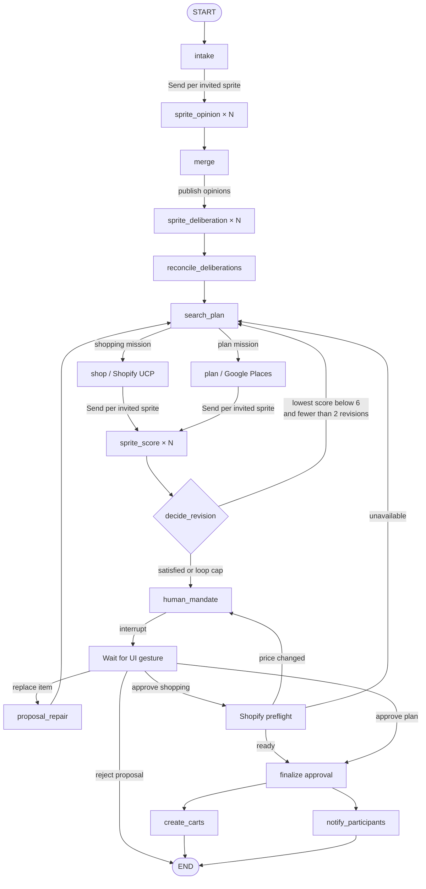

# Affinity agent backend

This directory contains the Python LangGraph pipeline and the HTTP boundary used by the frontend.

## Execution map



The fan-out workers return one-item lists. Reducers on `CouncilState` combine those concurrent writes by `spriteId`, creating the two fan-in barriers before `merge` and `decide_revision`.

Sprites do not exchange private profiles. The deliberation round receives the
other sprites' published opinions and the public constraint board, then emits a
visible response plus soft compromise wishes. Deterministic reconciliation may
add those wishes, but it never changes a hard rule.

## File guide

| File | Responsibility |
| --- | --- |
| `agent.py` | Declares nodes and edges, compiles the graph, and attaches the checkpointer. |
| `nodes.py` | Implements every graph node, fan-out router, and deterministic helper. |
| `models.py` | Defines shared payloads, graph state, and parallel-write reducers. |
| `llm.py` | Produces isolated sprite opinions, search plans, and scores in live or demo mode. |
| `catalog.py` | Enforces hard rules and budget limits in code. |
| `commerce/shopify_ucp.py` | Searches Shopify's Global Catalog and creates merchant carts after approval. |
| `places/google_places.py` | Searches Google Places with a minimal explicit field mask. |
| `notifications/smtp_email.py` | Emails an approved plan without blocking the async graph. |
| `data.py` | Loads profiles and products from the repository-level `data/` directory. |
| `api.py` | Starts and resumes checkpointed runs over HTTP. |
| `tests/` | Verifies filtering, fan-out/fan-in, revision limits, and the mandate interrupt. |

## State versus memory

`CouncilState` is working memory for one graph thread. `InMemorySaver` preserves that state across the mandate interrupt, but it is cleared when the server process stops. The current backend does not yet implement long-term family memory.

When long-term memory is added, retrieve it inside each sprite branch so a sprite receives only its own relevant history:

```text
intake
  └─ Send(sprite ID)
       └─ retrieve that sprite's relevant memories
            └─ sprite opinion
```

Confirmed outcomes should be written after the mandate, in a separate `write_memory` node between `human_mandate` and `END`. LLM-generated opinions should not automatically become permanent facts.

## Run locally

```bash
source .venv/bin/activate
pip install -r backend/requirements.txt
uvicorn backend.api:app --reload --port 8000 --env-file .env
```

Copy `backend/.env.example` to the repository-level `.env` when setting up a new machine. Keep `DEMO_MODE=true` for deterministic behavior. To use live structured model calls, set `DEMO_MODE=false`, provide `OPENAI_API_KEY`, and optionally set `OPENAI_SPRITE_MODEL`.

## HTTP lifecycle

Start a mission:

```http
POST /runs
Content-Type: application/json

{
  "threadId": "demo-family-tree",
  "mission": {
    "occasion": "Christmas",
    "budget": 200,
    "freeText": "A family tree",
    "type": "shared",
    "invitedSpriteIds": ["wife", "daughter", "son"]
  }
}
```

For live UI playback, call `POST /runs/stream`. It emits SSE events named
`mission`, `opinion`, `constraints`, `deliberation`, `consensus`, `search_plan`,
`bundle` or `plan`, `score`, `revision`, `repair`, `preflight`, and
`awaiting_mandate`, followed by `run_state`.
`POST /runs/resume/stream` streams receipt and post-approval events.

`profiles` is an optional sibling of `mission`. It accepts any number of full
profile objects. The IDs in `invitedSpriteIds` select which of those profiles
fan out through the graph; the three bundled profiles are only demo fixtures.

For a general product search, provide explicit slots:

```json
"shoppingSlots": [
  {"id": "basketball", "query": "full-size indoor/outdoor basketball under $20", "quantity": 1}
]
```

The response reaches `status: "interrupted"` when a proposed bundle is ready.
No merchant cart exists yet. Resume that exact thread after the handshake:

```http
POST /runs/resume
Content-Type: application/json

{
  "threadId": "demo-family-tree",
  "approve": true,
  "signature": "gesture-signature"
}
```

On approval, `create_carts` groups products by merchant and returns checkout
handoff links in `state.carts`. Rejection creates no cart.

To ask the agent for a replacement, resume with the rejected candidate ID and
an optional human prompt. Omitting `prompt` requests an autonomous replacement:

```json
{
  "threadId": "demo-family-tree",
  "action": "replace_agent",
  "itemId": "shopify:variant-123",
  "prompt": "Find a quieter, less expensive alternative"
}
```

Affinity locks the other accepted entries, searches only the affected slot,
excludes previously rejected candidates, reruns sprite scoring, and interrupts
with a new mandate. Shopping approval refreshes Shopify availability and price;
a changed price requires fresh approval before carts are created.

### Place-planning mission

Set `kind` to `plan`, provide a location and one or more required stops:

```json
{
  "kind": "plan",
  "occasion": "Family night",
  "budget": 160,
  "freeText": "Dinner and an activity",
  "type": "shared",
  "invitedSpriteIds": ["wife", "daughter", "son"],
  "location": {"label": "Georgia Tech, Atlanta, GA"},
  "when": "Saturday evening",
  "planSlots": [
    {
      "id": "dinner",
      "query": "casual vegetarian-friendly dinner",
      "includedType": "restaurant",
      "minRating": 4,
      "priceLevels": ["$", "$$"]
    },
    {"id": "activity", "query": "fun group activity", "minRating": 4}
  ]
}
```

The mandate exposes `state.plan`, including Maps and venue website links.
Approval records the decision but does not claim a reservation; real-time table
or ticket inventory requires a reservation or ticketing provider.

### Post-approval plan email

Add `email` and optional `emailNotifications` to each runtime profile. The
mandate contains a recipient preview, and no message is sent until approval.
Each participant receives an individual message so email addresses are not
shared with the group.

```dotenv
AFFINITY_EMAIL_PROVIDER=smtp
SMTP_HOST=smtp.example.com
SMTP_PORT=587
SMTP_SECURITY=starttls
SMTP_USERNAME=provider-user
SMTP_PASSWORD=provider-issued-secret
SMTP_FROM_EMAIL=plans@example.com
SMTP_FROM_NAME=Affinity
```

Use `AFFINITY_EMAIL_PROVIDER=console` to exercise the graph without sending,
or `disabled` to skip notifications. SMTP cannot provide exactly-once delivery;
a production deployment should persist an outbox/idempotency record in a
durable database before retrying failed graph nodes.
